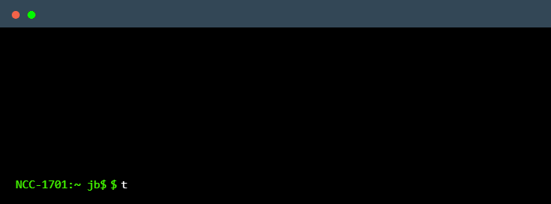

  

<!---  --->

### Hi there，I'm Jonathan Bonette 🙋‍♂️

- 🧠 Electronics Engineer working as a Backend Developer in the Financial Engineering department at C6 Bank.
- 💻 Focused on backend development with Kotlin, Java, Spring, distributed systems, and financial applications.
- 🤖 Currently expanding my knowledge in Artificial Intelligence, LLMs, and AI Agents.
  

  
  

